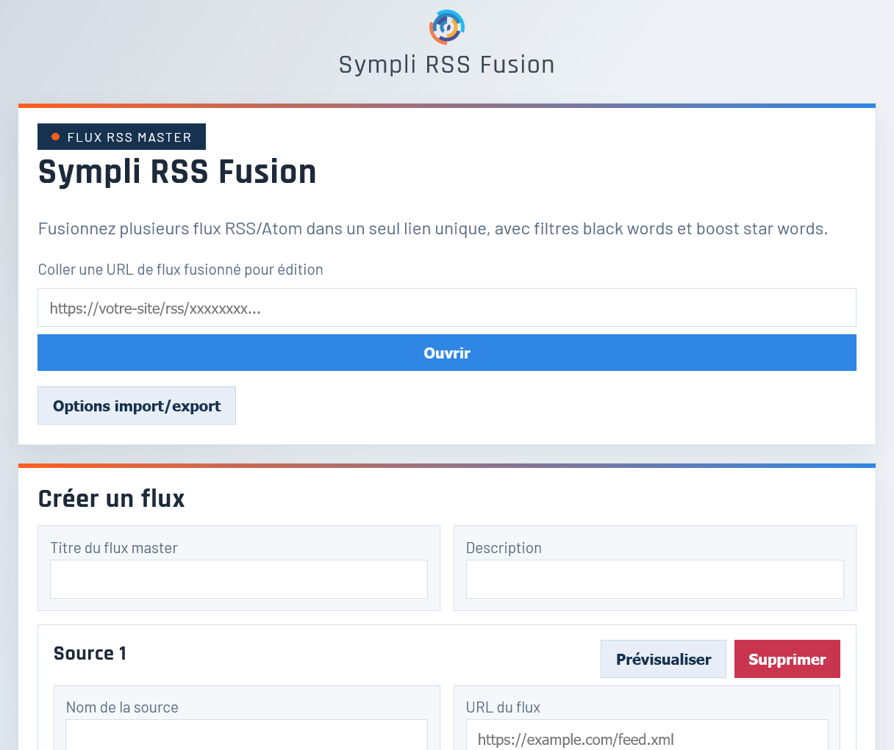
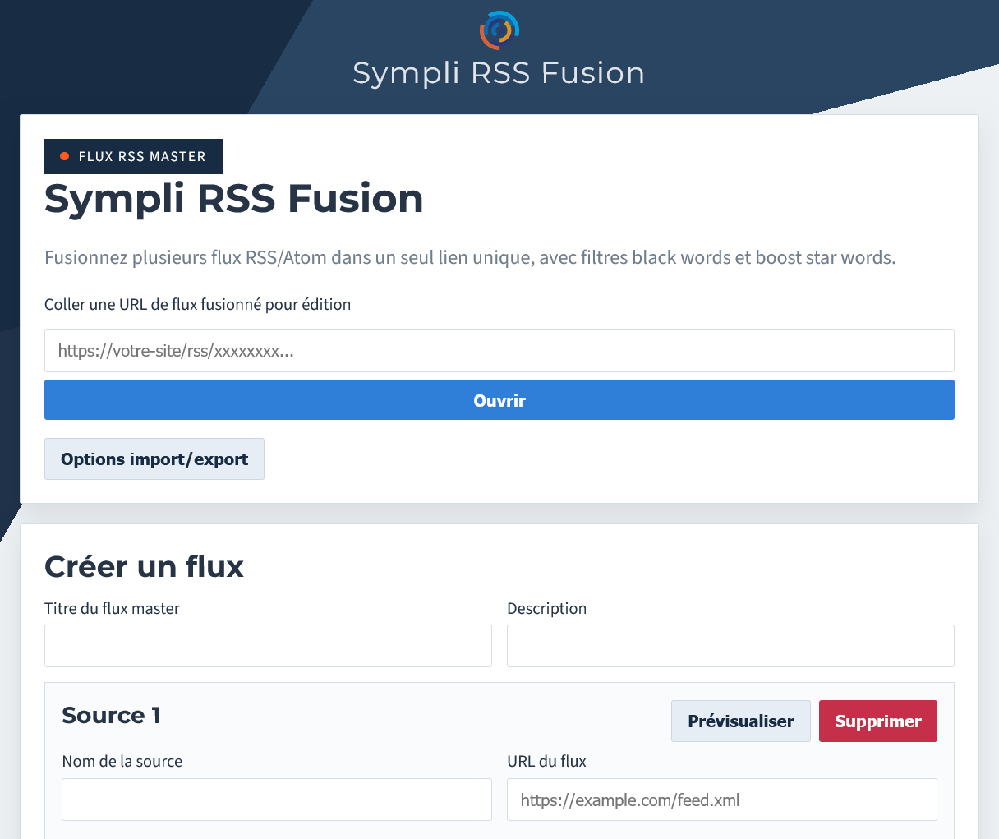
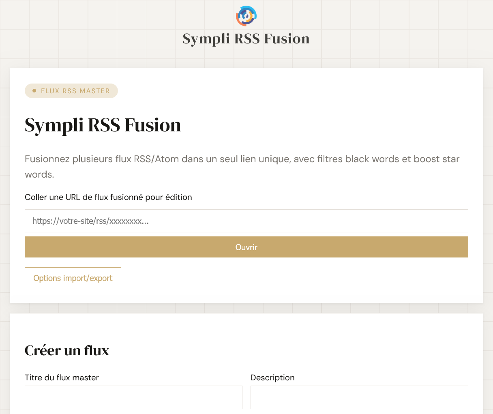
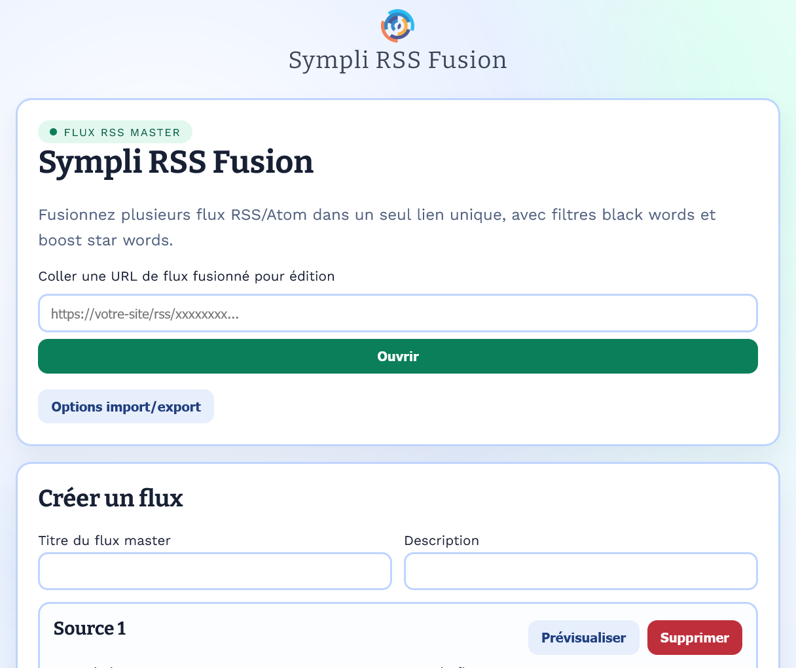

<p align="center">
	
</p>

<p align="center">
	<a href="https://github.com/GreenEffect/Sympli-RSS-Fusion/releases"></a>
	= 8.1">
	
	
</p>

# Sympli RSS Fusion

<p align="center">
  
  
</p>
<p align="center">
  
  
</p>

## FR

Sympli RSS Fusion est une application PHP auto-hébergeable pour fusionner plusieurs flux RSS/Atom en un flux master unique. Il s'agit d'une version "lite" et autonome de [RSS Fusion](https://www.rss-fusion.fr).

Démo en ligne : https://sympli.rss-fusion.com/

## 🧩 Approche KISS

Le projet reste volontairement simple : un front controller unique (`public/index.php`) et pas de dépendance (par exemple, Composer) obligatoire.

Le webroot doit pointer sur `public/`.
Ce choix protège automatiquement les fichiers sensibles hors web (`.env`, `var/data` SQLite, logs, source PHP).

## ✨ Fonctionnalités

- Fusion de plusieurs sources RSS/Atom dans un flux master.
- Filtres par source : black words et star words (titre/description/contenu).
- Prévisualisation source avec prise en compte immédiate des règles de filtrage.
- Import/export JSON depuis la page d'entrée et la page de gestion.
- Suppression manuelle d'un flux depuis l'UI.
- Suppression automatique optionnelle des flux inactifs.
- Interface multilingue FR/EN extensible via JSON.
- Themes configurables : `default`, `basic`, `dashboard`, `tiles`.
- Mode `dev` (erreurs détaillées, logs, DB dédiée).
- Pages d'erreur 404/500 + page Données personnelles.
- Vérification optionnelle de version distante avec alerte de mise à jour dans le footer.
- Protections de sécurité lors de la récupération des flux externes :
	- seules les URLs `http`/`https` sont acceptées;
	- résolution DNS + blocage d'adresses privées/localhost pour prévenir SSRF;
	- parsing XML avec entités externes désactivées pour prévenir XXE.
	- les imports JSON téléversés via l'interface sont limités à 1 MiB et le type MIME est vérifié pour éviter les téléversements volumineux malveillants.
	- les écritures du cache et des logs sont désormais atomiques (fichier temporaire + renommage) et utilisent un verrouillage de fichier pour éviter la corruption en cas d'accès concurrents.
	- un mécanisme de limitation de débit (rate-limiter) protège désormais les endpoints sensibles (prévisualisation, création, import/export). Les compteurs sont stockés côté serveur dans `var/rate/` (fichiers hachés contenant `count` et `start`) et une réponse HTTP 429 est renvoyée quand la limite est dépassée.

Note sur les journaux : le logger intégré écrit dans le fichier défini par `LOG_PATH` (par défaut `var/log/app.log`) et fournit des helpers `info()`, `warning()`, `error()` et `debug()`. Les écritures sont atomiques et protégées par `flock`, mais il n'y a pas de rotation automatique — configurez une rotation côté serveur (ex. `logrotate`) pour la rétention et éviter de remplir le disque.

	Configuration optionnelle (via `.env`): `RATE_FILE_TTL` (seconds before rate file eligible for purge, default 3600) et `RATE_PURGE_FREQUENCY` (minimum seconds between purges, default 3600).

## 🚀 Installation rapide

```bash
cp .env.example .env
php -S 127.0.0.1:8080 -t public
```

Puis ouvrir `http://127.0.0.1:8080`.

## ⚡ Installation ultra rapide

Déjà un serveur web ?
Déposez les fichiers du projet puis pointez la racine web vers le dossier `public`.

- Apache : `DocumentRoot /chemin/vers/Sympli-RSS-Fusion/public`
- Nginx : `root /chemin/vers/Sympli-RSS-Fusion/public;`
- Mutualisé : dans le panneau d'hébergement, définir le "document root" du domaine sur `.../public`

```bash
cp .env.example .env
```

Ensuite, ouvrez l'URL du domaine.

## ⚙️ Configuration .env

- `APP_NAME` : nom du projet (par défaut `Sympli RSS Fusion`).
- `APP_URL` : URL publique.
- `APP_LANG` : `fr` ou `en` (ou autre JSON dans `config/lang`).
- `APP_THEME` : `default`, `basic`, `dashboard`, `tiles` (ou thème custom).
- `APP_ENV` : `prod` ou `dev`.
- `DB_PATH` : base SQLite prod.
- `DB_PATH_DEV` : base SQLite dev.
- `LOG_PATH` : fichier de logs.
- `CACHE_DIR`, `CACHE_TTL`, `HTTP_TIMEOUT`, `MAX_ITEMS`.
- `AUTO_PRUNE_ENABLED`, `AUTO_PRUNE_DAYS`.
- `PREVIEW_ITEMS`.
- `VERSION_CHECK_ENABLED` : `1` pour activer la vérification de version distante (désactivé par défaut).

## 🛣️ Routes

- `GET /`
- `POST /create`
- `POST /import-master`
- `GET /export-master?token=...`
- `POST /import-master-opml`
- `GET /export-master-opml?token=...`
- `GET /manage/{token}`
- `POST /manage/{token}`
- `POST /manage/{token}/delete`
- `GET /manage/{token}/export`
- `POST /manage/{token}/import`
- `GET /manage/{token}/export-opml`
- `POST /manage/{token}/import-opml`
- `GET /preview-source?url=...`
- `GET /rss/{token}`
- `GET /privacy`

## 📚 Documentation projet

- Installation détaillée : `docs/INSTALL.md`
- Technique : `docs/DOCUMENTATION.md`
- Evolutions envisagées : `docs/ROADMAP.md`
- Données personnelles : `PERSONAL_DATA.md`
- Contribuer : `CONTRIBUTING.md`
- Sécurité : `SECURITY.md`
- Historique : `CHANGELOG.md`

*structure initiale du repository générée avec Claude.ai*

---

## EN

Sympli RSS Fusion is a self-hosted PHP application that merges multiple RSS/Atom feeds into a single master feed. This is a "lite" and standalone version of [RSS Fusion](https://www.rss-fusion.com)

Live demo: https://sympli.rss-fusion.com/

### 🧩 KISS approach

The project is intentionally simple: one front controller (`public/index.php`) and no mandatory Composer dependency.

The webroot must point to `public/`.
This protects sensitive files from direct web access (`.env`, SQLite data in `var/data`, logs, PHP source).

### ✨ Features

- Merge multiple RSS/Atom sources into one master feed.
- Per-source filters: black words and star words (title/description/content).
- Source preview with immediate filtering feedback.
- JSON import/export from home and management pages.
- Manual feed deletion from UI.
- Optional automatic pruning of inactive feeds.
- FR/EN multilingual interface extensible through JSON.
- Configurable themes: `default`, `basic`, `dashboard`, `tiles`.
- `dev` mode (detailed errors, logs, dedicated DB).
- Dedicated 404/500 pages + Personal data page.
- Optional remote version check with footer alert.
- Security

- External feed fetching is hardened to mitigate SSRF and XXE risks:
	- only `http`/`https` URLs are accepted;
	- hosts are resolved and private/localhost addresses are blocked;
	- XML parsing disables external entities to avoid XXE.

	- Uploaded JSON import files via the web UI are capped at 1 MiB and the file MIME/type is validated to mitigate oversized malicious uploads.

	- Cache and log writes are performed atomically (temp file + rename) and use file locking to avoid corruption under concurrent access.

	- A simple server-side rate limiter now protects sensitive endpoints (preview, create, import/export). Counters are stored in `var/rate/` as hashed files with `count` and `start`; requests exceeding limits receive HTTP 429 with `Retry-After`.

	Optional configuration via `.env`: `RATE_FILE_TTL` (seconds before rate file eligible for purge, default 3600) and `RATE_PURGE_FREQUENCY` (minimum seconds between purges, default 3600).

### 🚀 Quick install

```bash
cp .env.example .env
php -S 127.0.0.1:8080 -t public
```

Then open `http://127.0.0.1:8080`.

### ⚡ Fast server setup

Already running a web server?
Deploy project files and point your webroot to `public`.

- Apache: `DocumentRoot /path/to/Sympli-RSS-Fusion/public`
- Nginx: `root /path/to/Sympli-RSS-Fusion/public;`
- Shared hosting: set your domain document root to `.../public`

### ⚙️ .env configuration

- `APP_NAME`: project name (default `Sympli RSS Fusion`).
- `APP_URL`: public URL.
- `APP_LANG`: `fr` or `en` (or any JSON file in `config/lang`).
- `APP_THEME`: `default`, `basic`, `dashboard`, `tiles` (or custom theme).
- `APP_ENV`: `prod` or `dev`.
- `DB_PATH`: production SQLite path.
- `DB_PATH_DEV`: development SQLite path.
- `LOG_PATH`: logs file.
- `CACHE_DIR`, `CACHE_TTL`, `HTTP_TIMEOUT`, `MAX_ITEMS`.
- `AUTO_PRUNE_ENABLED`, `AUTO_PRUNE_DAYS`.
- `PREVIEW_ITEMS`.
- `VERSION_CHECK_ENABLED`: set `1` to enable remote version checks.

### 🛣️ Routes

- `GET /`
- `POST /create`
- `POST /import-master`
- `GET /export-master?token=...`
- `POST /import-master-opml`
- `GET /export-master-opml?token=...`
- `GET /manage/{token}`
- `POST /manage/{token}`
- `POST /manage/{token}/delete`
- `GET /manage/{token}/export`
- `POST /manage/{token}/import`
- `GET /manage/{token}/export-opml`
- `POST /manage/{token}/import-opml`
- `GET /preview-source?url=...`
- `GET /rss/{token}`
- `GET /privacy`

### 📚 Project documentation

- Installation: `docs/INSTALL.md`
- Technical: `docs/DOCUMENTATION.md`
- Planned developments : `docs/ROADMAP.md`
- Personal data: `PERSONAL_DATA.md`
- Contributing: `CONTRIBUTING.md`
- Security: `SECURITY.md`
- Changelog: `CHANGELOG.md`

*initial repository structure generated with Claude.ai*